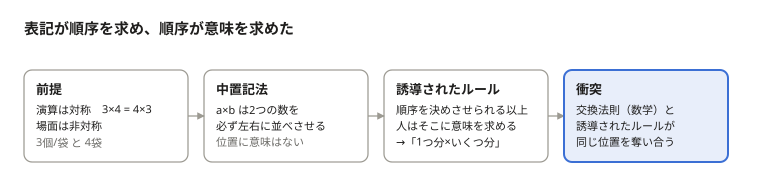
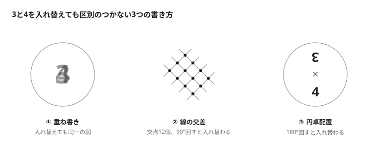

# 「かけ算の順序問題」の真犯人は「×」だった——交換法則が成り立つのに小学校の算数で 4×3 がバツになる本当の理由

**要旨**：かけ算の順序問題の根本は、交換法則が成り立つ演算を、順序を強制する中置記法（a × b）で書くことにある。表記が並び順を必ず決めさせるため、人はその並び順に意味を求めるよう誘導される。「1つ分×いくつ分」はその結果として生まれたルールであり、数学的な正しさと衝突した。解決は、順序をそもそも表せない表記で計算を表し、意味づけは式とは別に評価することである。

## 1. かけ算の順序問題とは何か

かけ算の順序問題とは、文章題の式を 3×4 と書くか 4×3 と書くかで正誤が変わるのか、という議論である。

> 例題：それぞれ3つのりんごが入った袋が4つあります。りんごは合わせて何個あるでしょう？

| 答案 | 多くの教室での扱い |
| --- | --- |
| 3×4 = 12 | 正解（1つ分 × いくつ分） |
| 4×3 = 12 | 減点または不正解 |

答えは同じ12なのに、式の並び順で評価が分かれる。これが半世紀以上続く論争の出発点である。

本稿で使う用語を定義しておく。

- **「1つ分×いくつ分」とは**、日本の小学校算数でかけ算を導入する際の式の形式で、「1つ分の数（被乗数）×いくつ分（乗数）」の順に書くことを指す。学習指導要領解説と教科書にこの表現がある。
- **交換法則とは**、a×b = b×a のように、2つの数を入れ替えても積が変わらない性質である。実数の乗法では公理として成り立つ。
- **「数字拾い」とは**、問題文の構造を読まずに、出てきた数字を出現順に並べて演算記号を付けるだけの解答行動を指す。順序指導が防ごうとしている対象である。

## 2. 順序を重視する立場と問わない立場は何を争っているのか

対立の軸は、かけ算を「数の計算」と見るか「場面（量）の表現」と見るかにある。前者なら交換法則により順序は無関係であり、後者なら順序によって意味を伝えるという立場が成り立つ。

| 論点 | 順序を重視する立場 | 順序を問わない立場 |
| --- | --- | --- |
| かけ算の意味 | 「1つ分の数×いくつ分」。式の順序が場面の構造を表す | 数のかけ算に順序はなく、3×4と4×3は等しい |
| 評価 | 立式の順序で、場面とかけ算の対応を理解しているかを便宜的にチェックできる | 正しい式と答えにバツを付けるのは不当。不信感や算数嫌いを生む |
| 交換法則 | 正式に教えるのは上の学年であり、導入段階では役割を区別する | 「まだ教えていないからバツ」は教える側の都合（遠山啓） |
| 社会の慣習 | x=vt、F=ma など、慣習で順序を決める例はある | 400mリレーは「4×100m」、レシートは「個数×単価」と逆順も普通に使われる |
| 小数・分数への拡張 | 導入期の足場であり、後に「倍」の見方へ拡張する | 「いくつ分」は整数でしか意味を持たず、順序の根拠は小数の乗法で崩れる |

- **文科省の立場**：学習指導要領解説は順序を「場面を式で表現する場合に大切にすべきこと」とする一方、取材には「大切なのは各数の意味の理解」と答え、順序で正誤を決めるとは明示していない（[東洋経済オンライン](https://toyokeizai.net/articles/-/442140)）。
- **経緯**：1965年ごろに始まり、1972年の新聞報道で全国に広まった。半世紀以上決着していない。

## 3. なぜ交換法則が成り立つのに順序でバツになるのか——根本原因は「×」の表記法

**かけ算の順序問題の根本原因は、教師でも数学者でもなく、順序を強制する中置記法「a × b」にある。** 交換法則により順序は数学的に無意味だが、表記が2つの数を左右に並べることを必ず決めさせるため、その並び順に意味を与えるルールが誘導される。

> **図の内容**: 「表記が順序を求め、順序が意味を求めた」（左から右への4段階）
> 1. 前提 — 演算は対称（3×4 = 4×3）、場面は非対称（3個/袋 と 4袋）
> 2. 中置記法 — a×b は2つの数を必ず左右に並べさせる。位置に意味はない
> 3. 誘導されたルール — 順序を決めさせられる以上、人はそこに意味を求める →「1つ分×いくつ分」
> 4. 衝突（強調）— 交換法則（数学）と誘導されたルールが同じ位置を奪い合う

重要なのは、教育者が能動的に順序へ意味を与えたのではない、という点である。表記が「どちらを先に書くか」を必ず決めさせる以上、書き手も読み手もその選択に理由を求める。意味のない選択を毎回強いられれば、人はそこに意味を見いだそうとする。「1つ分×いくつ分」は、この誘導に対して算数教育が与えた自然な答えであって、誰かが恣意的に持ち込んだ規則ではない。だからこそ、指導者を批判しても問題は解けない。順序を要求する表記が残る限り、同じ誘導が繰り返される。

双方の主張はそれぞれ正しく、噛み合わないのは表記の側である。割り算（12÷3）のように演算自体が非対称なら順序の要求は妥当であり、論争も起きていない。

### りんごと面積——逆のケースが同じ結論を示す

|  | りんごの例題 | 長方形の面積 |
| --- | --- | --- |
| 2つの数の役割 | 異なる（1袋あたり／袋の数） | 同じ（どちらも長さ） |
| 場面に順序の理由 | ある | ない（90°回せば入れ替わる） |
| それでも起きること | 役割を位置でしか表せない | 「縦×横」の順序が指導される |
| 示すこと | 表記に役割の置き場がない | 表す違いがなくても順序は強制される |

### 教育面の懸念——「数字拾い」の答案をどう見抜くか

順序指導が防ごうとしているものははっきりしている。「1つ分」「いくつ分」の構造を読み取らず、問題文に出てきた数字をその順に並べて×を付けただけの答案、いわゆる「数字拾い」である。この懸念は正当である。割り算に進むと、構造を読めない子は立式そのものができなくなるからだ。

| 問題文 | 構造を読めた子 | 数字拾いの子 | 並び順で見抜けるか |
| --- | --- | --- | --- |
| 3個ずつ入った袋が4つ。全部で何個？ | 3×4 | 3×4 | 見抜けない（出現順が一致） |
| 袋が4つ。どの袋にも3個ずつ。全部で何個？ | 3×4 または 4×3 | 4×3 | 見抜けるが、理解して 4×3 と書いた子も巻き込む |
| 12個を4つの袋に同じ数ずつ。1袋何個？ | 12÷4 | 12÷4 | 見抜けない |
| 3個ずつ袋に入れる。りんごは12個。袋はいくつ？ | 12÷3 | 3÷12 | 割り算では式自体が誤りになる |

表が示すとおり、かけ算の並び順は数字拾いの検出器として精度が低い。出現順が一致する問題では見逃し、逆順の問題では理解した子を誤検出する。一方、割り算は非可換なので、数字拾いは順序指導と無関係に誤答として表面化する。さらに「12÷4」と「12÷3」のどちらを立てるかは、3と4のどちらが「1つ分」かを読めて初めて決まる。構造の理解は割り算で不可欠になる。だからこそ、かけ算の段階では並び順ではなく構造そのものを確かめるべきである。

この弱さは実測でも確認されている。伊藤宏（2001、宮城県教育センター）が小学3年生34名に「4枚の袋に3個ずつ」の問題を出したところ、3×4と書いたのは8名、4×3と書いたのは21名で、4×3の21名は全員が場面の絵を正しく描けた。金田茂裕（2008）では小学2年生108名の正答率は、順序を問わなければほぼ100%、「1つ分×いくつ分」の順のみ正解とすると80%台だった。なお、順序指導の有無で成績を直接比較した研究は確認できていない（数値は[Wikipedia「かけ算の順序問題」](https://ja.wikipedia.org/wiki/%E3%81%8B%E3%81%91%E7%AE%97%E3%81%AE%E9%A0%86%E5%BA%8F%E5%95%8F%E9%A1%8C)および[わさっきhb](https://takehikom.hateblo.jp/entry/20141120/1416430248)経由）。

単位を付けさせれば、この構造は直接見える。数字拾いの子は「3袋」「4個」と単位を付け間違えるか、単位を付けられない。そして同じ単位が割り算の立式をそのまま導く：12個 ÷ 4袋 = 3個/袋（等分除）、12個 ÷ 3個/袋 = 4袋（包含除）。並び順は割り算に引き継げないが、単位は引き継げる。

### 小数・実数のかけ算で順序の根拠はどうなるか——整数の外で消える

「1つ分×いくつ分」の非対称性は、「いくつ分」が個数（自然数）である間しか成り立たない。数の範囲が広がるにつれて、順序を正当化していた根拠の方が先に消える。

| 数の範囲 | 例 | 「いくつ分」の読み | 順序の根拠 |
| --- | --- | --- | --- |
| 自然数 | 3個 × 4袋 | 成り立つ（累加：3+3+3+3） | ある |
| 小数・分数 | 3個 × 2.5袋、0.4m × 1.5 | 崩れる（「2.5回足す」は定義できず、「倍」に読み替える） | 弱い |
| 負の数 | (−3) × (−4) | 成り立たない（「−4回分」に意味はない） | ない |
| 実数 | √2 × π | 成り立たない | ない（公理で可換） |

小学校の算数自体が、小数の乗法で「累加」から「倍」へ意味を拡張する。その時点で「いくつ分」の役割は消え、両者は対等な「倍率」になる。実数の乗法は公理として可換であり、被乗数と乗数の区別はそもそも存在しない。

つまり順序のルールは、自然数の範囲でだけ成り立つ足場である。足場なら外せばよいが、中置記法の並び順は外せない。根拠が消えた後も並び順だけが残る——これが、本来意味を持たない位置に意味を持たせることの代償である。逆に、面積（アレイ）の見方は 2.5cm × 0.4cm にそのまま伸びる。対称な見方だけが実数へつながる。

## 4. 順序を強制しない表記は可能か——3つの提案

目指すべきは「順序はあるが意味がない」表記ではなく、「順序をそもそも表せない」表記である。並び順が紙の上に残る限り、第3節で述べた仕組みによって、そこに再び意味が持ち込まれるからである。

### 4.1 意味の除去だけでは足りない

単位つきの式（3個/袋 × 4袋）、関数表記（かけ算(1つ分=3, いくつ分=4)）、集合表記（Π{3, 4}）は、並び順から意味を取り除く。しかし一列に書く以上、「3が左、4が右」という並び順は残る。「左は1つ分」というルールが再び生まれる余地は消えていない。

### 4.2 判定の基準

2つの数を入れ替えて書いた図が、元の図とまったく同じか、元の図を回転・反転させただけのものであること。この基準を満たせば、図の中に「どちらが先か」を示す手がかりは存在しない。

### 4.3 順序を表せない3つの表記

- **① 重ね書き**：2つの数を同じ位置に重ねて書く。入れ替えても図は完全に同じだが、読みにくくデジタル表示が前提。
- **② 線の交差**：3本と4本の平行線を交差させ、交点の数（12）を積とする。線引きかけ算として実在する計算法で、面積（アレイ）と同じ構造を持つ。
- **③ 円卓配置**：中心に×を置き、数を円周上に外向きに置く。読み始めの位置が決まらず、3つ以上の数にも広げられる。

> **図の内容**: 「3と4を入れ替えても区別のつかない3つの書き方」
> - ① 重ね書き: 円の中に 3 と 4 を同じ位置に重ねて書く。入れ替えても同一の図
> - ② 線の交差: 斜めの平行線3本と4本を交差させ、交点12個に点を打つ。90°回すと入れ替わる
> - ③ 円卓配置: 円の中心に ×、上に逆さの 3、下に 4。180°回すと入れ替わる

どの図も、3と4を入れ替えると同じ図か、回転しただけの図になる。

| 表記 | 入れ替えたとき | 読みやすさ | 3つ以上の数の積 | 小数・実数への拡張 |
| --- | --- | --- | --- | --- |
| 現行：3×4 | 別の式になる | 高い | 可能（並び順も増える） | 可能（順序の根拠は消える） |
| 単位つき・関数・集合 | 並び順が変わる | 高い | 可能 | 可能 |
| ① 重ね書き | 同一の図 | 低い（1桁向き） | 困難 | 可能 |
| ② 線の交差 | 90°回転した図 | 中（小さい数向き） | 困難 | 不可（本数は自然数のみ） |
| ③ 円卓配置 | 180°回転した図 | 中 | 容易 | 可能 |

### 4.4 式と意味の役割分担

順序を表せない表記は、役割の情報も持てない。そこで式と意味を分ける。

|  | 担うもの | 評価するもの |
| --- | --- | --- |
| 式 | 数の計算（順序なし） | 答えが合っているか |
| 説明 | 「1つ分」「いくつ分」の意味づけ | なぜかけ算で求まるかを理解しているか |

単位つきの式（3個/袋 × 4袋）は、計算の式ではなく「説明」を書く手段として生かせる。見るのは並び順ではなく単位の付け方である。

## 5. 順序指導を擁護する反論にどう答えるか

| 反論 | 応答 |
| --- | --- |
| 小2に「個/袋」のような単位は難しい | 「/」は不要。教科書にある「3こずつ」「4ふくろ分」で足りる |
| 順序での評価は大人数に効率的 | 単位の確認も一目で済む。しかも順序は文中の出現順を写すだけでも一致するが、単位は場面を読まないと付けられない |
| 中学以降は普通の×を使うのだから無意味 | 順序を表せない表記は×の代替ではなく、導入期に「積に順序はない」を体験させる教材。理解した後は×に移ってよい |
| 順序のルールがあれば式を聞いただけで場面が伝わる | ルールを共有する集団の中でしか成り立たない（4×100mリレーは逆順）。単位や引数名はルールを知らない読み手にも伝わる |

## 6. 結論：かけ算の順序問題はどう解決すべきか

測るべきは「なぜかけ算で求まるか」という意味づけであり、数式の並び順ではない。

本稿の結論は3点である。

1. かけ算の順序問題の根本原因は、順序を強制する中置記法にあり、教師と数学者の対立ではない。
2. 答案の正誤は、式の並び順ではなく、単位や説明による意味づけで判断すべきである。
3. 導入期には順序を表せない表記で「積に順序はない」ことを体験させ、意味づけは式とは別に評価する。

|  | 従来 | 本稿の提案 |
| --- | --- | --- |
| 正誤の根拠 | 式の並び順 | 意味づけ（単位・説明） |
| 3×4 と 4×3 | 片方だけ正解 | どちらも正解 |
| 誤りとするもの | 逆順の式 | 役割の取り違え（3袋 × 4個/袋） |
| 交換法則との関係 | 衝突する | 衝突しない |

留意点は2つある。問う意味づけの中身は問題で変わる（りんごは役割の区別、面積はマスの並びの仕組み）。また、意味づけを書かせるのは導入段階に限る。毎回要求すれば、それ自体が順序指導と同じ形式的な規則になる。

## 7. よくある質問

**4×3 と書くとなぜバツになるのか？** 多くの教室で「1つ分×いくつ分」の順に書く指導があり、業者テストの採点基準もそれに従うことがあるためである。学習指導要領解説は順序を「大切にすべきこと」とするが、順序で正誤を決めよとは書いていない。

**かけ算の順序はどちらが正しいのか？** 数学的にはどちらも正しい。交換法則により 3×4 = 4×3 である。順序に意味があるのは、「場面を式で表す」という教育上のルールの中だけである。

**文部科学省の見解は？** 東洋経済オンラインの取材（2021年）に対し、「順序がどうというよりも、それぞれの数が何を意味しているのかを理解することが大切」と回答している。順序どおりでなければバツにせよという指示はない。

**順序指導の効果を示す研究はあるのか？** 順序指導の有無で成績を比較した研究は確認できていない。児童の実態調査（伊藤2001、金田2008）は、逆順で書いた児童も場面を理解していることを示している。

**本稿の提案は何か？** 順序を表せない表記（重ね書き・線の交差・円卓配置）で計算を表し、「1つ分」「いくつ分」の意味づけは単位や説明として式とは別に評価することである。

## 出典

- [掛け算の順序問題と学習指導要領・文科省の見解](https://toyokeizai.net/articles/-/442140)（東洋経済オンライン、2021年7月27日）
- [「掛け算の順序」「×、÷ の書き順」、小学校算数のあきれた規則](https://gendai.media/articles/-/77978)（金重明、現代ビジネス、2021年1月6日）
- [かけ算の順序](https://www.juen.ac.jp/g_katei/nunokawa/IAQs/commutativity_of_multiplications.pdf)（上越教育大学、PDF、日付記載なし）
- [掛け算順序問題](https://scrapbox.io/bbr-math-memo/%E6%8E%9B%E3%81%91%E7%AE%97%E9%A0%86%E5%BA%8F%E5%95%8F%E9%A1%8C)（Scrapbox、個人メモ）
- [かけ算の順序問題](https://ja.wikipedia.org/wiki/%E3%81%8B%E3%81%91%E7%AE%97%E3%81%AE%E9%A0%86%E5%BA%8F%E5%95%8F%E9%A1%8C)（Wikipedia日本語版。伊藤宏2001の数値の出典）
- [かけ算の順序のエビデンス 4選](https://takehikom.hateblo.jp/entry/20141120/1416430248)（わさっきhb、2014年11月20日。金田茂裕2008の数値の出典）
