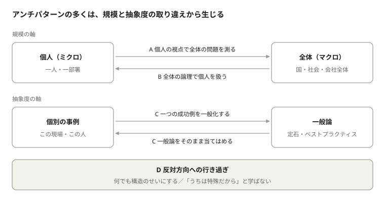

# ミクロとマクロをつなぐリテラシー

## はじめに

まず言葉を確認しておこう。「ミクロ」とは物事を細かく、一つひとつの要素に注目して見ること、「マクロ」とは物事を大きく、全体としてまとめて見ることを指す。たとえば一人の買い物の判断を考えるのがミクロ、国全体の景気を考えるのがマクロである。森にたとえるなら、一本の木を見るのがミクロ、森全体を見るのがマクロだ。

個々の要素について正しいことが、全体についても正しいとは限らない。逆に、全体について正しいことが、個々の要素に当てはまるとも限らない。

この単純な事実は、物理学から経済学、生物学、組織論に至るまで、あらゆる分野で繰り返し確認されてきた。それにもかかわらず、私たちは日常的に「一人ひとりがこうなのだから、社会全体もこうなるはずだ」「平均がこうなのだから、目の前のこの人もこうだろう」と推論してしまう。

本稿の主張はひとつである。ミクロとマクロのあいだには、そのまま延長できない「段差」がある。その段差をどう渡るかについての感覚、すなわちミクロとマクロをつなぐリテラシーは、専門家だけでなく、判断を下すすべての人にとって基礎的な素養である。

以下ではまず、さまざまな分野の事例でミクロとマクロの段差を確かめる。次に、その段差を無視したときに起きる二方向の誤りと、段差が生じる仕組みを見る。そのうえで、問題解決の場面に現れる典型的な失敗を整理し、最後にそれを避けるための考え方を示す。

## 分野をまたぐ事例

スケールによって振る舞いが変わる現象は、特定の分野だけの珍しい話ではない。身近な例から見ていこう。

**物理学：一つの分子には「温度」がない。** 空気は無数の小さな分子でできていて、それぞれが飛び回っている。私たちが「暑い」「寒い」と感じる温度とは、この分子たちが平均してどれだけ速く動いているかの目安である。つまり温度は、たくさんの分子が集まって初めて意味を持つ言葉で、一つの分子だけを取り出しても「この分子は何度か」とは言えない。

もう一つ不思議な点がある。分子一つひとつの動きは、ビデオを逆再生しても物理法則に反しない。ところが現実の世界では、熱いコーヒーは放っておけば冷めるのに、冷めたコーヒーが勝手に熱くなることはない。個々の分子には「時間の向き」がないのに、集まると一方通行の変化が生まれる。

**経済学：みんなで節約すると、みんなが貧しくなる。** 景気が悪くなると、将来が不安になって多くの家庭が出費を控える。一家庭として見れば、これは賢い判断だ。しかし、ある人の出費は別の誰かの収入でもある。全員が一斉に買い物を減らすと、お店や会社の売上が落ち、そこで働く人の給料も減る。結果として社会全体ではお金がたまらず、かえって苦しくなることがある。経済学ではこれを「節約のパラドックス」と呼ぶ。

**交通：原因のない渋滞。** 高速道路では、事故も工事もないのに渋滞が起きることがある。きっかけは、前の車がほんの少しブレーキを踏むことだ。後ろの車は念のため少し強めにブレーキを踏み、さらに後ろの車はもっと強く踏む。この減速が後ろへ後ろへと増幅しながら伝わり、やがて車が止まってしまう。一人ひとりのドライバーは普通に運転しているだけで、誰も渋滞を起こそうとしていない。

**生物学：賢くないアリと、賢いアリの巣。** 一匹のアリは「仲間のにおいが濃い道をたどる」といった単純なルールで動いているにすぎない。それでも巣全体としては、エサまでの近道を見つけたり、仕事を分担したりと、まるで知性があるかのように振る舞う。賢さは一匹のアリの中ではなく、アリ同士のやり取りの中から生まれている。

**統計：分けると逆転する数字。** 二つの病院の手術成功率を比べるとしよう。病院Aは全体の成功率で負けているのに、「軽症の患者」「重症の患者」に分けて比べると、どちらでも病院Aのほうが成績がよい、ということが起こりうる。病院Aに重症の患者が多く集まっていれば、全体の数字が引き下げられるからだ。このように、まとめ方次第で結論がひっくり返る現象を「シンプソンのパラドックス」という。

**組織：優秀な人を集めても強いチームになるとは限らない。** スポーツでもビジネスでも、スター選手を集めたチームが期待ほど勝てないことはよくある。情報がうまく共有されない、全員が主役になりたがる、評価の仕組みが協力を妨げる。チームの強さは、個人の能力を足し算しただけでは決まらない。

## 二方向の誤り

スケールをまたぐときの失敗は、向きによって二つに分けられる。どちらも「ある大きさで見て正しいことを、別の大きさにそのまま持ち込む」ことから生じる。

**ミクロからマクロへ：「一人でうまくいくなら、全員でもうまくいく」という誤り。** 専門用語では「合成の誤謬（ごびゅう）」と呼ばれる。誤謬とは、もっともらしく見えて実は間違っている推論のことだ。

わかりやすい例が劇場である。前の席の人が見えにくいとき、自分だけ立ち上がれば舞台はよく見える。しかし全員が立ち上がれば、誰も前より見やすくならず、全員が疲れるだけだ。先ほどの節約のパラドックスも同じ構造をしている。

この誤りの背景には、「部品を完全に理解すれば、全体も理解できる」という考え方がある。時計なら確かにそうだが、人や生き物のように互いに影響し合うものの集まりでは、部品を調べるだけでは全体の動きがわからないことが多い。

**マクロからミクロへ：「全体の傾向は、一人ひとりにも当てはまる」という誤り。** こちらは「生態学的誤謬」と呼ばれる。名前は難しいが、中身は単純だ。

たとえば「この地域は平均年収が高い」と聞いて、「この地域に住むAさんはお金持ちだ」と考えるのは早合点である。ごく一部の大金持ちが平均を押し上げているだけかもしれない。「この薬は患者の7割に効く」というデータも、「あなたに7割の確率で効く」という意味とは限らない。体質によって、よく効く人とまったく効かない人にはっきり分かれている可能性があるからだ。

「平均的な人」は実際にはほとんど存在しない、ということも覚えておきたい。かつてアメリカ空軍がパイロット数千人の体のサイズを測り、平均値に合わせて操縦席を設計しようとしたことがある。ところが調べてみると、主要な寸法がすべて平均の範囲に収まるパイロットは一人もいなかったという。

二つの誤りは鏡に映したような関係にある。前者は全体を「部分を大きくしたもの」と見なし、後者は部分を「全体を小さくしたもの」と見なしている。

## なぜ振る舞いが変わるのか

スケールが変わると振る舞いが変わるのは、偶然ではない。その裏には、いくつかの共通した仕組みがある。

**1. お互いに影響し合うから。** 渋滞の例で見たように、一人の行動が周りの人の行動を変え、それがまた別の人の行動を変える。こうした連鎖があると、全体は「一人ひとりの行動を足し合わせたもの」にはならない。銀行に預金を引き出す人が殺到する取り付け騒ぎや、SNSの炎上も同じ仕組みで起こる。

**2. 変化が比例しないから。** 水は0度を少し上回っていれば液体だが、0度を下回ると急に固体（氷）になる。温度を少しずつ下げていっても、ある点で性質がガラッと変わる。このように「少し変えたら少し変わる」が成り立たない性質を「非線形性」という。流行やブーム、生態系の崩壊など、ある一線を越えたとたんに一気に進む現象は社会にも自然界にも多い。

**3. 全体を見るときは細かい情報を捨てているから。** 天気予報は、空気の分子一つひとつの動きを計算しているわけではない。気温、気圧、風向きといった大まかな量だけで天気を予測する。細部を思い切って捨てることで、初めて全体の傾向が見えるのだ。これは地図にたとえるとわかりやすい。日本地図に家の一軒一軒を描き込めば、かえって役に立たなくなる。ただし裏を返せば、全体の話から細部（一軒の家）を知ることはできない。

**4. 「平均」だけでは中身がわからないから。** 平均点60点のクラスでも、全員が60点前後なのか、100点と20点に分かれているのかで、まったく状況が違う。ばらつきの大きさや偏りを見ないまま平均で判断すると、全体についても個人についても見誤る。

平均の弱点を知ると、今度は「中央値を使えば実態がわかる」と考えたくなる。中央値とは、全員を小さい順に並べたときにちょうど真ん中に来る人の値である。たとえば年収の平均は、ごく一部の高所得者に大きく引き上げられる。真ん中の人の年収である中央値のほうが、多くの人の実感に近い。ここまでは正しい。

しかし、中央値を万能の物差しのように扱うのも、また別の誤りである。中央値も平均と同じく、分布を一つの数字に縮めたものにすぎないからだ。

- **両端の変化が映らない。** 中央値は真ん中の一人だけを見ているので、上位の人がどれだけ豊かになっても、下位の人がどれだけ苦しくなっても、真ん中が動かなければ変わらない。格差の広がりは、中央値だけを見ていると見落とす。
- **山が二つあると、誰の姿でもなくなる。** 先ほどの、100点と20点の生徒に半々で分かれたクラスを考えてみよう。このとき中央値は、真ん中の二人（20点と100点）の間をとって60点になり、平均と同じく実在しない生徒の点数を指す。
- **合計が問題のときは、平均のほうが役に立つ。** 予算や保険金の支払い総額のように「全体でいくら必要か」が問われる場面では、平均に人数を掛ければ総額が出る。中央値からは総額は出ない。保険の支払いでは、ごくまれな巨額の請求が総額を大きく左右するが、中央値はその存在をまったく反映しない。

つまり、平均と中央値のどちらが正しいという話ではない。「いま何を知りたいのか」によって使うべき数字は変わる。そして、どの数字を使うにしても、元の分布の形（ばらつきの大きさ、偏り、山がいくつあるか）を一度は自分の目で見ておくことが欠かせない。一つの数字で全体を代表させようとする限り、どの指標を選んでも、捨てた情報の分だけ見えないものが残る。

**5. 大きさによって、効いてくる力が入れ替わるから。** アリは自分の何倍もの高さから落ちても平気だが、ゾウはそうはいかない。小さな生き物には空気の抵抗が大きく効き、大きな生き物には重さが大きく効くからだ。人間の集団も同じで、数人の仲間なら信頼や気持ちで動けるが、数万人の組織になるとルールや制度がなければ回らない。

**6. 時間の長さによって答えが変わるから。** 一度きりの取引なら、相手をだますほうが得に見えることもある。しかし同じ相手と何度も取引するなら、信頼を守るほうが結局は得になる。短い期間で正しいことが、長い期間ではひっくり返ることがある。

## 問題解決におけるアンチパターン

ここまで見てきたスケールの取り違えは、問題解決の場面ではいくつかの決まった形で現れる。こうした典型的なつまずき方をアンチパターンと呼ぶ。その多くは、問題が起きている「規模」や「抽象度」と、見方や打ち手のそれとが食い違うことから生じる。

規模とは、個人の話か全体の話かという軸である。抽象度とは、一般論か個別の事例かという軸だ。抽象度の軸も、ミクロとマクロの関係によく似ている。一般論は多くの事例をまとめて得られた「全体」の知識であり、個別の事例はその「部分」にあたるからだ。A〜Dが二つの軸のどこで起きるかは、この節の最後の図にまとめた。

### A. 全体の問題を個人の視点に縮める（矮小化）

「二方向の誤り」で見た合成の誤謬が、問題解決の場面で現れたものである。

- 国政を「私の暮らしやすさ」だけで測る：政策を、自分の手取りや身の回りの物価だけで評価してしまうパターンだ。生活実感は大事な手がかりだが、それだけでは他の世代・地域・立場の人への影響や、長い時間をかけて表れる効果が見えない。自分には恩恵がなくても社会を支えている制度もあれば、自分には有利でも別の誰かに負担が回る政策もある。
- 仕組みの問題を個人のせいにする：長時間労働に時間管理の研修で対応したり、システム障害を担当者のミスで片づけたりするケースである。原因になっている仕組みが残るので、同じ問題がまた起きる。
- 局所最適を積み上げる：各部署がそれぞれのKPIを最適化した結果、会社全体では効率が落ちることがある。

### B. 全体の論理で個人を扱う（押し付け）

こちらは生態学的誤謬が現れたものである。

- 平均値で個別に判断する：「一般に効果がある」施策を、目の前の相手に効くかどうか確かめずに使うことだ。
- 集団の傾向で個人にラベルを貼る：「この層にはこういう傾向がある」という情報から、目の前の一人を決めつけることだ。

### C. 一般論と個別の事例を取り違える

- ベストプラクティスをそのまま当てはめる：その手法が前提にしている条件を確かめずに導入するパターンである。
- 一つの成功例を一般化する：成功を支えた人や状況を見ないまま、他の場所に横展開することだ。
- 抽象的な言葉でまとめて終わる：「コミュニケーション不足」と括ってしまうと、誰が何を変えるのかが決まらない。

### D. 反対方向への行き過ぎ

- 何でも構造のせいにする：「社会が悪い」「制度が悪い」で止まり、個人やチームがいまできる工夫を検討しないパターンだ。
- 「うちは特殊だから」と言う：個別の事情を理由に、一般的な知見や他の事例から学ぶことを拒む。

### E. どの方向でも起きるもの

- 線形に延長する：「少し増やせば少し良くなる」と考え、ある一線を越えると性質が変わる可能性を見落とす。
- 打ち手の大きさを取り違える：構造的な問題に小手先の対策を、局所的な問題に大がかりな制度改革をぶつけるケースである。

> **図の内容**: 「アンチパターンの多くは、規模と抽象度の取り違えから生じる」
> - 規模の軸: 個人（ミクロ／一人・一部署）⇄ 全体（マクロ／国・社会・会社全体）。個人→全体の向きが「A 個人の視点で全体の問題を測る」、全体→個人の向きが「B 全体の論理で個人を扱う」。
> - 抽象度の軸: 個別の事例（この現場・この人）⇄ 一般論（定石・ベストプラクティス）。事例→一般論の向きが「C 一つの成功例を一般化する」、一般論→事例の向きが「C 一般論をそのまま当てはめる」。
> - 両軸の下に「D 反対方向への行き過ぎ」（何でも構造のせいにする／「うちは特殊だから」と学ばない）。

AとBは規模の軸を、Cは抽象度の軸を、それぞれ逆向きにたどる誤りである。Dは、そうした誤りを避けようとして反対側に寄りすぎた状態だ。では、こうした誤りを避けるには何が必要だろうか。

## つなぐためのリテラシー

ミクロとマクロをつなぐリテラシーとは、難しい理論を知っていることではない。個人の話と全体の話、一般論と個別の事例を行き来するときに、立ち止まって次のような問いを投げかける習慣のことである。

1. **いま話しているのは「一人」の話か、「全体」の話か。** 議論がかみ合わないとき、実は一方は個人の話、もう一方は社会全体の話をしていることがよくある。問題が起きている規模と、自分の打ち手が効く規模が合っているかも確かめたい。
2. **いま考えているのは一般論か、この事例に固有の事情か。** 定石を当てはめるときはその前提がこの事例でも成り立つかを、一つの事例から学ぶときはそれがどこまで他に通用するかを問う。
3. **その数字はどうやってまとめられたものか。** 平均だけを見ず、ばらつきも確かめる。中央値に置き換えれば済むわけでもなく、分布の形そのものを見る。男女別、年代別などに分けても同じ結論になるかを確かめる（病院の例を思い出してほしい）。
4. **全員が同じことをしたらどうなるか。** 一人の行動が周りに影響するなら、一人にとっての正解が全員にとっての正解とは限らない。この問いは、合成の誤謬を避けるいちばん手軽な方法である。
5. **まとめるときに何を捨てたか。** 全体の傾向をつかむには細部を捨てる必要があるが、捨てた細部が個人の判断には決定的なこともある。地図の縮尺を意識するように、自分がどの細かさで見ているかを自覚する。
6. **どこかで急に変わる「境目」はないか。** 「これまで少しずつ変わってきたから、これからも少しずつだろう」と決めつけず、一線を越えると一気に変わる可能性を考える。

そのうえで効果的なのは、片方の視点で出した結論を、もう片方の視点で検証し直すことだ。個人の視点で考えた対策は「全員がそうしたらどうなるか」で、全体の視点で考えた対策は「目の前のこの人にとってはどうか」で見直す。この往復が、前節で見たA〜Dのどの偏りにも効く。

学問の世界でも、この段差を渡るための方法が長年かけて工夫されてきた。たとえば物理学には、無数の分子の動きから温度や圧力のふるまいを導く分野（統計力学）がある。経済学では、個人や会社の行動から国全体の景気を説明しようとする試みが続いている。最近では、単純なルールで動く多数の「仮想の人」をコンピューターの中で動かし、どんな全体のパターンが生まれるかを観察する研究（エージェント・ベース・シミュレーション）も盛んだ。

こうした専門的な方法を自分で使う必要はない。大切なのは、なぜそうした方法が必要になったのか、つまり「個人の話を単純に大きくしても、全体の話にはならない」という認識を持っておくことである。

## おわりに

ミクロとマクロのあいだの段差を意識することは、いまほど重要な時代はない。

国の政策は、一人ひとりの行動を変えることで社会全体を動かそうとし、その効果は統計の数字で測られる。企業は個々のユーザー行動のデータから市場を読み解き、組織のルールで個人の働き方を設計する。AIの分野でも、一つひとつは単純な計算をするだけの部品を大量につなぎ合わせたところ、作った人すら予想しなかった能力が現れることが話題になっている。どの場面でも、ミクロとマクロの往復が意思決定の中心にある。

このリテラシーを欠くと、私たちは二つの方向で過ちを犯す。個人の美徳を積み上げれば社会がよくなると信じて構造の問題を見落とすか、統計上の傾向で目の前の一人を裁いてしまうか、である。その反省から反対側に振れすぎて、何でも構造のせいにしてしまうこともある。

逆に、このリテラシーを身につけると、見え方が変わる。「誰も悪くないのに悪い結果が生じる」状況を、誰かを責めることなく構造の問題として捉えられる。平均の向こうにいる一人ひとりの多様さにも目が届く。

部分と全体は、どちらか一方に還元できるものではない。両者をつなぐ仕組みに目を向けること。それが、複雑な世界を誤らずに理解するための、もっとも基本的な作法である。
