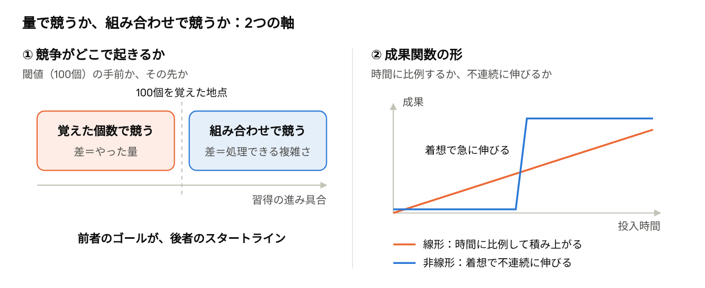
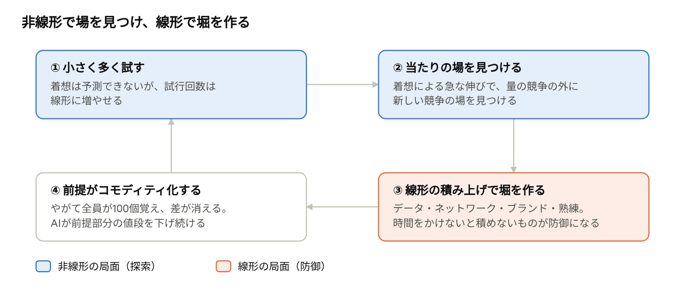

# 量で競う人、組み合わせで競う人 ― 経験が形づくる競争観とその摩擦

どんな競争を経験してきたかによって、人は「努力」「公平」「進捗」の意味をまったく違うものとして理解するようになる。この違いは個人間では摩擦を生み、組織では戦略上の盲点になる。

## 問い：2つの競争経験

出発点は次の2つの対比だ。

1. 覚えることが100個ある場合に、100個覚えていない集団の中で覚えた個数を競ってきた人と、100個覚えたことを前提にそれらを組み合わせて、どれだけ複雑な問題を処理できるかを競ってきた人。
2. 時間をかければ必ず完了するタスクでどれだけ時間をかけられたかを競ってきた人と、アイデア次第で時間に対して不連続な成果が生まれるタスクで成果を競ってきた人。

2つの例はよく似ているが、それぞれ別の軸を指している。軸を分けて考えると、摩擦がなぜ起きるのかと、戦略を考えるための手がかりが見えてくる。

## 2つの軸：競争の場所と成果関数の形

例①は「競争がどこで起きているか」の違いで、例②は「投入した時間と成果の関係がどんな形か」の違いだ。

> **図の内容**: 「量で競うか、組み合わせで競うか：2つの軸」
> - ① 競争がどこで起きるか（閾値＝100個の手前か、その先か）: 習得の進み具合を横軸に、「100個を覚えた地点」の手前が「覚えた個数で競う（差＝やった量）」、先が「組み合わせで競う（差＝処理できる複雑さ）」。前者のゴールが、後者のスタートライン。
> - ② 成果関数の形（時間に比例するか、不連続に伸びるか）: 投入時間に対し、線形は時間に比例して積み上がり、非線形はしばらく横ばいのあと着想で急に伸びる。

例①の前者は、前提をどれだけ満たしたかで競う。後者は、前提を満たし終えたところから競い始める。そのため同じ100個の知識を持っていても、前者は「完成した」と感じ、後者は「やっと道具が揃った」と感じる。

例②の前者の世界では、成果は時間にほぼ比例する。後者の世界では、着想によって成果が不連続に大きく伸びる。

## 経験が生む捉え方の違い

どちらの成果関数で勝ってきたかによって、同じ状況でも受け止め方が変わる。

| 観点 | 量で競ってきた人 | 組み合わせや着想で競ってきた人 |
| --- | --- | --- |
| 「100個覚えた」 | ゴールであり、完成 | スタートラインで、道具が揃っただけ |
| 努力の意味 | 投入した量 | 探索の質（量は前提条件） |
| 公平感 | 差を量で説明できるので、結果を公正だと感じる | 同じ努力でも結果がばらつくのが普通 |
| 評価 | 数えれば比較できる | 評価する側にも目利きが必要 |
| 身につく力 | 時間を投入し続ける力 | どこに時間を使うかを選ぶ力と、試行が無駄になっても耐える力 |
| 不慣れな場での失敗 | 網羅や長時間労働で勝とうとして消耗する | 積み上げを「当然のこと」と軽く見て、足元をすくわれる |

ただし、2つの世界が断絶しているわけではない点が大事だ。量の積み上げは、組み合わせの素材になる。違うのは能力ではなく、自分の競争がどの段階にあるかという思い込みのほうだ。

## コミュニケーションの摩擦：同じ言葉、違う意味

世界が断絶していなくても、人の認識は断絶しうる。両者は同じ言葉を違う意味で使うため、断絶そのものが見えにくい。そこが厄介だ。

| 言葉 | 量の世界での意味 | 組み合わせの世界での意味 | 起きる摩擦 |
| --- | --- | --- | --- |
| 「わかった」 | 覚えた | 組み合わせて使える | 「わかりました」と言われたのに使えず、嘘をつかれたと感じる |
| 「進捗」 | 何%終わったか | ブレイクスルーの直前までは0%に見える | 「サボっている」「考えていない」と互いに見る |
| 「いつ終わる？」 | 普通の質問 | 答えようのない問い詰め | 「やってみないとわからない」という返事が逃げに聞こえる |
| 「頑張った」 | 量を認めてほしい | 着想を認めてほしい | 「時間かけたね」は着想型の人に、「で、何が新しいの？」は量型の人に、それぞれ否定に聞こえる |

このズレは上司と部下の関係で特に強く出る。量の世界の上司は、着想型の部下を「サボっている」と見る。着想型の上司は、量の世界の部下を「手を動かしているだけ」と見る。

## なぜ断絶に気づけないのか

人は相手の振る舞いを、前提の違いではなく能力や姿勢の問題として受け取りがちだ。自分の前提は当然すぎて言葉にされない。そのため違和感は「あの人は考えが浅い」「あの人は根性がない」という人柄の評価に置き換わり、前提の違いに気づく前に関係が壊れる。

さらに、2つの世界観は対等ではない。量は測りやすいので、勤怠やKPIといった組織の制度に組み込まれやすい。そのため着想型の人は、制度の上で不利になりがちだ。反対に、着想型の人は一度成果が出ると、量の積み上げを見下しやすくなる。どちらの側も、自分の世界を基準にしてしまいやすい。

## 摩擦を減らすには：人ではなくタスクで合意する

相手の世界観を変えさせるのは難しい。現実的なのは、タスクごとに「これは線形か、非線形か」を先に合意しておくことだ。

1. 着手する前に、成果関数を名前で共有する。「これは時間をかければ終わるタスク」「これは探索タスク」と口に出すだけで、その後に使う言葉の意味がそろう。
2. 報告の形式を分ける。線形タスクは「何%終わったか」で、非線形タスクは「試した仮説の数」と「除外できた可能性」で進捗を伝える。
3. 非線形タスクには、締切ではなく見直す時点を置く。「いつ終わる？」を「いつ、続けるかどうかを判断する？」に置き換える。

これだけでも、「いつ終わる？」をめぐる衝突のかなりの部分は避けられる。

## 戦略思考への展開

戦略の文脈では、どの成果関数の上で戦うかを選ぶこと自体が戦略になる。

> **図の内容**: 「非線形で場を見つけ、線形で堀を作る」（循環図）
> 1. 小さく多く試す — 着想は予測できないが、試行回数は線形に増やせる（非線形の局面・探索）
> 2. 当たりの場を見つける — 着想による急な伸びで、量の競争の外に新しい競争の場を見つける（非線形の局面・探索）
> 3. 線形の積み上げで堀を作る — データ・ネットワーク・ブランド・熟練。時間をかけないと積めないものが防御になる（線形の局面・防御）
> 4. 前提がコモディティ化する — やがて全員が100個覚え、差が消える。AIが前提部分の値段を下げ続ける → 1 に戻る

強い戦略はこの循環を回し続ける。いまどの段階にいるかによって、取るべき打ち手が変わる。

量の競争は戦略ではない。ポーターが業務効率と戦略を区別したように、量や時間の競争では相手も同じように積み上げられるので、優位が続かない。いまはAIが「覚える」「時間を投入する」部分のコストを下げている。前提部分で競ってきた人や組織ほど、自分の競争の場が消えていくことに気づきにくい。

線形の組織は、非線形の兆しを見落とす。既存企業は線形の改善で勝ってきたので、評価の軸も報告の形式も線形になる。新興企業の試みは初期には「進捗0%」に見えるため、脅威だと受け止められない。個人間の言葉のズレが、組織では戦略上の盲点として表れるわけだ。イノベーションのジレンマは、この関係で説明できる。

強い戦略は、2つの成果関数を順に使う。着想で手に入れた場は、すぐに真似される。しかし、時間をかけないと積めないものを後から積み上げれば、後発は同じ時間をかけない限り追いつけない。この段階では、線形の積み上げがいちばん強い防御になる。

個々の着想は予測できないが、試行の回数は線形に増やせる。小さく多く試し、当たったものに賭け金を寄せれば、運に見えるものを量の問題に近づけられる。ただし、一度の失敗を責める評価制度の下では、このやり方は機能しない。戦略を変えるときは、評価制度も同時に変える必要がある。

相手の認識を利用することもできる。線形型の相手とは量の勝負をせず、相手が積み上げている前提の価値がなくなる方向へ場をずらす。非線形型の相手には、先に堀を積んで、着想が広がる余地を塞いでおく。

## 結び

量で競う力と組み合わせで競う力に、優劣はない。問題になるのは、経験によって「自分が戦う成果関数はこれだけだ」と認識が固定されることだ。

この固定は、個人間では言葉のズレとして、組織では戦略上の盲点として表れる。だから、いまの局面がどちらの関数なのかを見極めて切り替える力が必要になる。そして経験を積んだ人ほど、その切り替えは難しくなる。
