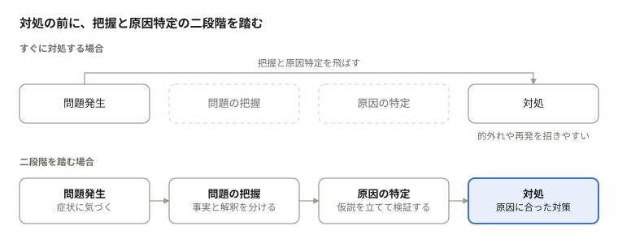
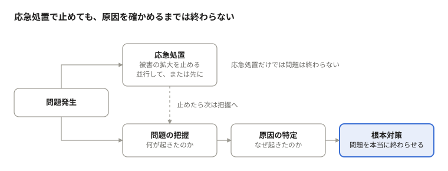

# 対処の前に、二つの段階がある

## 問題が起きると、人はすぐに答えを探しはじめる

システムが止まった。売上が落ちた。子どもが学校に行きたがらない。問題に直面すると、私たちはほぼ反射的に「どうすればいいか」を考えはじめる。頭の中にはすでに解決策の候補が並び、どれから試すかを選ぼうとしている。

一見すると、これは行動力のある健全な反応に見える。しかし実際には、必要な段階を二つ飛ばしている。問題の把握と、原因の特定である。この二つを経ずに打った対策は、当たれば幸運、外れれば問題を複雑にするだけの賭けにすぎない。

本稿では、この二つの段階がなぜ欠かせないのか、そしてなぜ人はそれを飛ばしてしまうのかを考えたい。

> **図の内容**: 「対処の前に、把握と原因特定の二段階を踏む」
> - すぐに対処する場合: 問題発生 → （問題の把握・原因の特定を飛ばす）→ 対処。的外れや再発を招きやすい。
> - 二段階を踏む場合: 問題発生（症状に気づく）→ 問題の把握（事実と解釈を分ける）→ 原因の特定（仮説を立てて検証する）→ 対処（原因に合った対策）。

上の段では、問題に気づいてすぐ対処へ進み、把握と原因特定が抜け落ちている。下の段のように二つの段階を経て、はじめて原因に合った対策を選べる。

## 第一段階は、何が起きているのかを正確に捉えること

問題の把握とは、「何が、いつから、どこで、どの程度起きているのか」を事実として捉えることだ。「売上が落ちた」は把握ではない。「先月から新規顧客の売上だけが前年比で3割減り、既存顧客は横ばい」まで言えて、ようやく把握になる。

このとき、事実と解釈を分けることが重要だ。「お客さんが離れている」は解釈で、「来店数が減った」は事実だ。最初の報告には、たいてい誰かの解釈が混ざっている。それをそのまま問題として受け取ると、出発点からずれてしまう。

問題がどこまで広がっているかを確かめることも大切だ。どこで起きていて、どこでは起きていないのか。この違いが、次に原因を特定するときの最大の手がかりになる。把握が甘いまま進むと、そもそも解くべき問題を取り違える。

## 第二段階は、症状と原因を切り分けること

把握した事実は、あくまで症状である。熱が出ているという事実は、それが風邪なのか、別の感染症なのかを教えてくれない。解熱剤は熱を下げるが、原因が細菌なら病気は進行し続ける。

原因の特定とは、「なぜそれが起きているのか」を仮説と検証で絞り込む作業だ。先の例で言えば、新規顧客だけが減っているなら集客経路の変化を疑える。広告の配信設定は変わっていないか、検索順位は落ちていないか、近くに競合が出店していないか。仮説を立て、データや現場で確かめ、外れたものを消していく。

ここで陥りやすいのが、最初に思いついた原因に飛びつくことだ。もっともらしい説明が一つ見つかると、人はそこで考えるのをやめてしまう。「他の原因では説明できないか」「この原因が正しいなら、他にも起きているはずのことが本当に起きているか」と問い直して、ようやくその原因が確からしいと言えるようになる。

## なぜ私たちは段階を飛ばしてしまうのか

理由の一つは焦りである。問題は不快で、早く終わらせたい。調べている時間は何も進んでいないように感じられ、手を動かしている方が安心できる。

二つ目は、行動そのものが評価されやすいことだ。組織では「すぐ手を打った人」が頼もしく見え、「まず調べます」と言う人は遅く見える。上司や顧客から「で、どうするの」と問われれば、何か答えを出さずにはいられない。

三つ目は、経験による思い込みである。似た問題を解決した経験があると、今回も同じだと決めつけてしまう。見た目が似ていても、原因が同じとは限らない。経験は仮説を立てるときには役に立つが、検証の代わりにはならない。

## 段階を飛ばした対処が招くもの

第一に、的外れな対策になる。原因が集客経路にあるのに接客研修を強化しても、売上は戻らない。投じた時間とお金は回収されず、問題はそのまま残る。

第二に、症状だけが消えて問題が再発する。表面的な対処でいったん収まると、人は解決したと思い込む。原因は手つかずのまま残り、しばらくして同じ問題が、ときにより大きな形で戻ってくる。

第三に、対策そのものが新たな問題を生む。原因を理解しないまま仕組みに手を入れると、思わぬ副作用が出る。元の問題と副作用が絡み合うと、次に原因を探すのがさらに難しくなる。最初に省いた手間は、後でより大きな手間となって返ってくる。

## すぐに対処を考えてしまう人と、どう話すか

すぐに対処を口にする人を、正面から否定しても話は進まない。「それは早すぎる」と言えば、相手は責められたと感じて自分の案を守りにかかる。まずはその案を受け止め、出発点として使う方がうまくいく。

相手の案を問いに変えて返すのが有効だ。「その対策が効くとしたら、原因は何だと考えていますか」と尋ねる。対処案の裏には、たいてい言葉にされていない原因の仮説が隠れている。それを言葉にしてもらうだけで、話は自然と原因の検討へ戻る。

事実を確かめるときは、詰問ではなく一緒に見る姿勢をとる。「いつから起きていますか」「どこでは起きていませんか」と、相手と同じ側に立って問いを並べる。答えに詰まる箇所が、そのまま調べるべき箇所になる。

焦りが強い相手には、時間を区切って安心させる。「30分だけ状況を整理してから決めましょう」と終わりを示せば、調べる時間は停滞ではなく手順の一部に変わる。被害を止める応急処置は並行して進めると明言すれば、なおよい。

相手が上司や顧客で「で、どうするの」と迫られたときは、調べることそのものを行動として示す。「まず新規顧客の流入経路を確認し、明日の15時までに原因の見立てと対策案をお持ちします」。何をいつまでにやるかが見えれば、多くの人は待てる。

そして最後に、自分自身がその人になっていないかを振り返りたい。問題を前にして真っ先に解決策を考えてしまうのは、誰にでもある癖だからだ。

## 急がば回れ。ただし応急処置は先にしてよい

ここまで述べたことは、何もせずに調べ続けろという意味ではない。火事が起きていれば、原因究明より先に火を消すべきだ。システム障害なら、まず切り戻してサービスを復旧させる。被害の拡大を止める応急処置は、把握や原因特定と並行して、あるいはそれより先に行ってよい。

> **図の内容**: 「応急処置で止めても、原因を確かめるまでは終わらない」
> - 問題発生から二つの流れが出る。一つは応急処置（被害の拡大を止める。並行して、または先に）。応急処置だけでは問題は終わらない。
> - もう一つは 問題の把握（何が起きたのか）→ 原因の特定（なぜ起きたのか）→ 根本対策（問題を本当に終わらせる）。
> - 応急処置で止めたら、次は把握へ進む。

応急処置は被害の拡大を止めるためのもので、先に行ってもよい。ただし問題を終わらせるのは、把握と原因特定を経た根本対策の方だ。

応急処置と根本対策を区別し、応急処置で問題が終わったと思わないことが大事だ。止血をしたら、次に「何が起きたのか」「なぜ起きたのか」を落ち着いて確かめる。そのうえで打つ対策だけが、問題を本当に終わらせる。

問題が起きたとき、最初に問うべきは「どうするか」ではない。「何が起きているのか」、そして「なぜ起きたのか」である。この二つに答えてから「どうするか」を考える。遠回りに見えて、それが最も早く、確実に問題を解く道だ。
